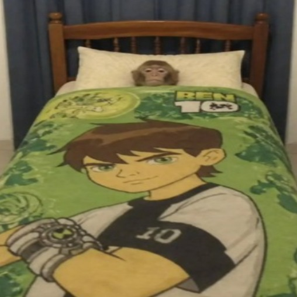

<!-- ===== HEADER ===== -->


<p align="center">
  <a href="https://git.io/typing-svg">
    
  </a>
</p>

<p align="center">
  
  <a href="mailto:mastraenzo@gmail.com"></a>
</p>

---

### 🐒 `whoami`

```js
const enzo = {
  location:      "Argentina 🇦🇷",
  role:          "Computer Engineer",
  askMeAbout:    ["AI agents", "automations", "full-stack apps", "fernet ratios"],
  funFact:       "My avatar is a monkey with a MacBook. It is an accurate representation.",
};
```

---

### 🚀 What I do

```diff
+ 🤖 AI agents & LLM-powered stuff
+ ⚙️ Automations so robots do the boring part
+ 🌐 Full-stack apps, front to back
+ 🐳 Dockerizing everything that moves
- 🐛 Bugs (I don't write them, they just appear)
```

---

### 🛠️ Toolbox

<p align="center">
  
</p>

---

### 🛏️ Me after a deploy on Friday

<p align="center">
  
</p>

---

### 😂 Random dev joke (refresh for another one)

<p align="center">
  
</p>

<!-- ===== FOOTER ===== -->

